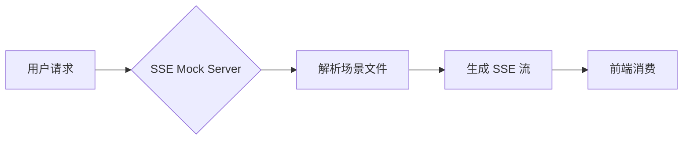
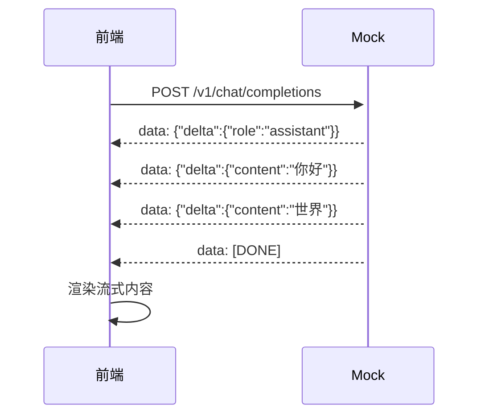

<!-- @desc: 完整 GFM 演示 —— diff / Mermaid / 数学公式 / 嵌套引用 / Emoji -->
# 📝 Markdown 完整演示

<!-- @delay: 80 -->
<!-- @chunk: sentence -->

这是一份完整的 GFM (GitHub Flavored Markdown) 演示场景，展示了 AI SSE Mock 对富文本输出的支持。

<!-- @delay: 200 -->

## 1. 段落与文本样式

普通段落文本。**加粗**、*斜体*、~~删除线~~、`行内代码`、<u>下划线</u>。

<!-- @delay: 150 -->

## 2. 引用块

> 这是一段引用。
>
> > 这是嵌套引用。
>
> 引用结束。

<!-- @delay: 200 -->

## 3. 代码块

### JavaScript

```javascript
import { readFileSync } from 'node:fs';

const data = readFileSync('./file.json', 'utf-8');
const parsed = JSON.parse(data);

console.log(parsed.name);
// Output: AI SSE Mock
```

### Python

```python
def fibonacci(n: int) -> int:
    if n <= 1:
        return n
    return fibonacci(n - 1) + fibonacci(n - 2)

for i in range(10):
    print(f"fib({i}) = {fibonacci(i)}")
```

### Diff 格式

```diff
-function oldName() {
-  return "old";
+function newName() {
+  return "new";
 }
```

<!-- @delay: 200 -->

## 4. 数学公式 (KaTeX)

行内公式：$E = mc^2$

块级公式：

$$
\int_{a}^{b} f(x) \, dx = F(b) - F(a)
$$

$$
\sum_{k=1}^{n} k = \frac{n(n+1)}{2}
$$

<!-- @delay: 200 -->

## 5. Mermaid 图表





<!-- @delay: 200 -->

## 6. 表格

| 序号 | 项目名称 | 状态 | 优先级 |
|:----:|---------|:----:|:------:|
| 1 | SSR 渲染 | ✅ 完成 | 🔴 高 |
| 2 | 流式输出 | ✅ 完成 | 🔴 高 |
| 3 | 缓存优化 | ⏳ 进行中 | 🟡 中 |
| 4 | 日志系统 | ⬜ 待办 | 🟢 低 |

<!-- @delay: 150 -->

## 7. 任务列表

- [x] OpenAI SSE 格式兼容
- [x] Markdown + 指令场景格式
- [x] 多策略 chunk 切分
- [ ] Anthropic 格式支持
- [ ] Gemini 格式支持
- [ ] Web UI 可视化

<!-- @delay: 150 -->

## 8. 链接与图片

- 链接：[GitHub](https://github.com)
- 自动链接：<https://example.com>

<!-- @delay: 200 -->

## 9. Emoji 与特殊字符

🎉 🚀 ✅ ❌ ⚠️ 💡 🔥 ⭐ 🐛 🔧 📦 🎯 💻 📊

<!-- @delay: 150 -->

---

以上是 **AI SSE Mock** 对 GFM 的完整支持演示。你可以通过 `@chunk: word` 切换到逐词输出模式体验更细腻的流式效果。
